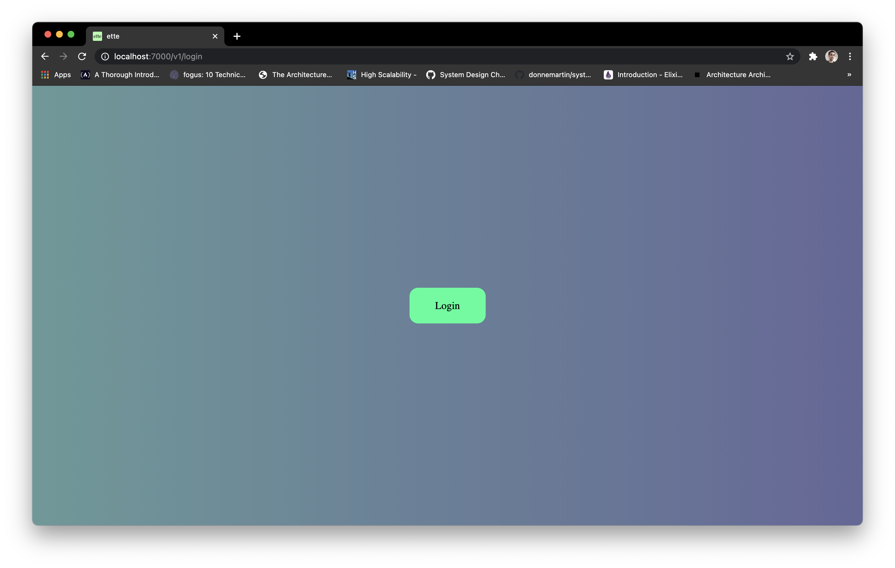
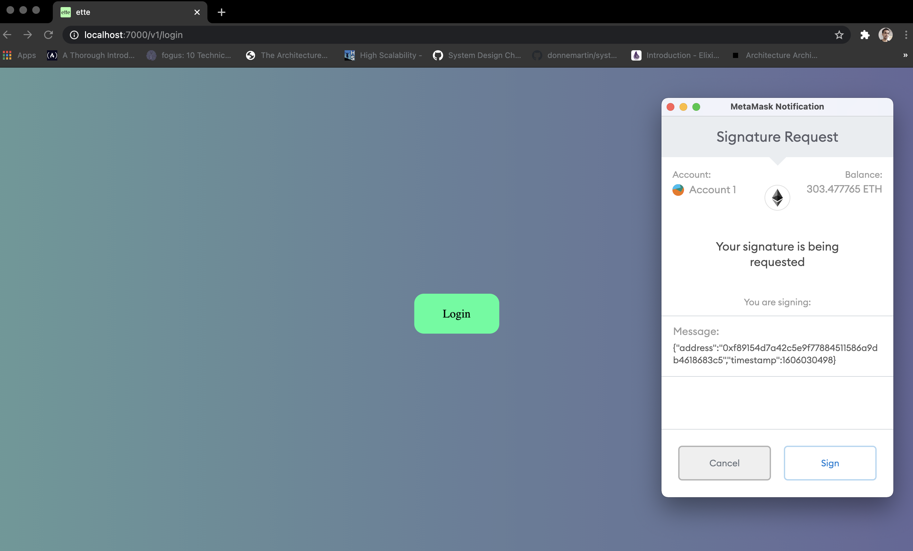
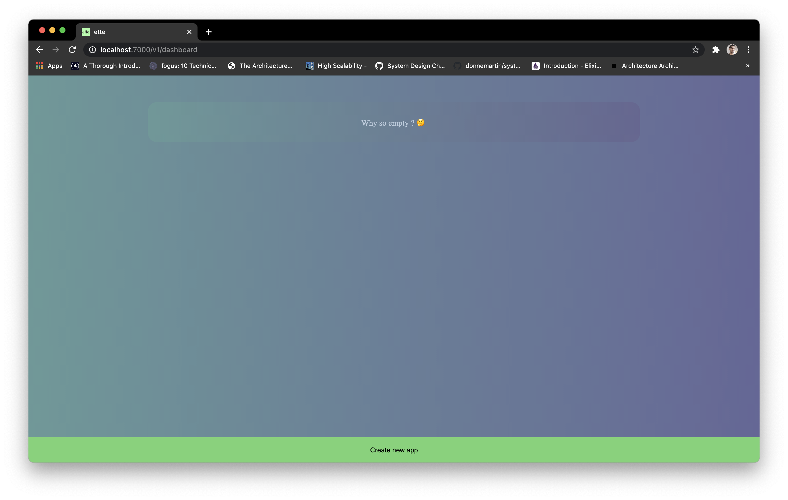
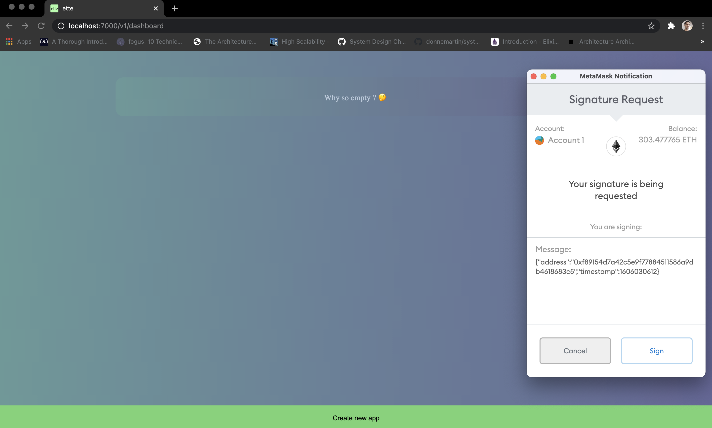
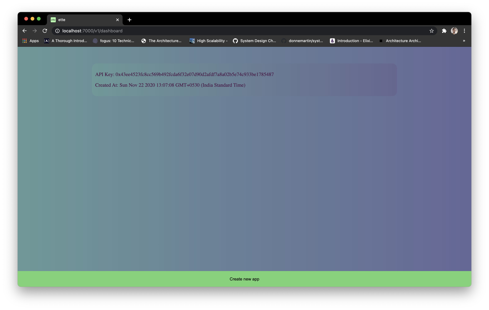

# ette

EVM-based Blockchain Indexer, with historical data query & real-time notification support 😎

**Deploy your `ette` instance today**


## Table of Contents

- [Why did you build `ette` ?](#inspiration-)
- [What do I need to have to use it ?](#prerequisite-)
- [How to install it ?](#installation-)
- [What are possible use cases of `ette` ?](#use-cases-)
- [How do I generate `APIKey`(s) ?](#management-using-webui-)
- [How to use it ?](#usage-)
    - Historical Data
        - Custom REST
            - [Query historical block data](#historical-block-data--rest-api--)
            - [Query historical transaction data](#historical-transaction-data--rest-api--)
            - [Query historical event data](#historical-event-data--rest-api--)
        - GraphQL
            - [Query historical block data](#historical-block-data--graphql-api--)
            - [Query historical transaction data](#historical-transaction-data--graphql-api--)
            - [Query historical event data](#historical-event-data--graphql-api--)
    - Real-time Data
        - [Real-time block mining notification](#real-time-notification-for-mined-blocks-)
        - [Real-time transaction notification ( 🤩 Filters Added ) ](#real-time-notification-for-transactions-%EF%B8%8F)
        - [Real-time log event notification ( 🤩 Filters Added ) ](#real-time-notification-for-events-)

## Inspiration 🤔

I was looking for one tool which will be able to keep itself in sync with latest happenings on EVM based blockchain i.e. index blockchain data, while exposing REST & GraphQL API for querying blockchain data with various filters. That tool will also expose real time notification functionalities over websocket, when subscribed to topics.

It's not that I was unable find any solution, but wasn't fully satisfied with those, so I decided to write `ette`, which will do following

- Sync upto latest state of blockchain
- Listen for all happenings on EVM based blockchain
- Persist all happenings in local database
- Expose REST & GraphQL API for querying 👇, while also setting block range/ time range for filtering results. Allow querying latest **X** entries for events emitted by contracts.
    - Block data
    - Transaction data
    - Event data

- Expose websocket based real time notification mechanism for 
    - Blocks being mined
    - Transactions being sent from address and/ or transactions being received at address
    - Events being emitted by contract, with indexed fields i.e. topics

- All historical data query requests must carry authentication header as `APIKey`, which can be generated by users, using webUI, packed with `ette`.
- All real-time event subscription & unsubscription requests must carry `apiKey` in their payload.
- It has very minimalistic webUI for creating & managing `APIKey`(s).

And that's `ette`

## Prerequisite 👍

- Make sure you've Go _( >= 1.15 )_ installed
- You need to also install & set up PostgreSQL. I found [this](https://www.digitalocean.com/community/tutorials/how-to-install-and-use-postgresql-on-ubuntu-20-04) guide helpful.
- Redis needs to be installed too. Consider following [this](https://www.digitalocean.com/community/tutorials/how-to-install-and-secure-redis-on-ubuntu-20-04) guide.
- Blockchain Node's websocket connection URL, required because we'll be listening for events in real time.

## Installation 🛠

- First fork this repository & clone it, some where out side of **GOPATH**.

```bash
git clone git@github.com:username/ette.git
```

- Now get inside `ette`

```bash
cd ette
```

- Create a `.env` file in this directory. 

    - Make sure PostgreSQL has md5 authentication mechanism enabled.
    - Please enable password based authentication in Redis Server.
    - `Admin` is ethereum address who will be able to administer `ette` using webUI. _[ **This feature is not yet implemented, but please put `Admin` in config file** ]_
    - Replace `Domain` with your domain name i.e. `ette.company.com`
    - Set `Production` to `yes` before running it in production; otherwise you can simply skip it
    - `ette` can be run in any of 3 possible modes, which can be set by `EtteMode`

    ```json
    {
        "1": "Only Historical Data Query Allowed",
        "2": "Only Real-time Event Subscription Allowed",
        "3": "Both Historical Data Query & Real-time Event Subscription Allowed"
    }
    ```

    - For testing historical data query using browser based GraphQL Playground in `ette`, you can set `EtteGraphQLPlayGround` to `yes` in config file

```
RPC=wss://<websocket-endpoint>
PORT=7000
DB_USER=user
DB_PASSWORD=password
DB_HOST=x.x.x.x
DB_PORT=5432
DB_NAME=ette
RedisConnection=tcp
RedisAddress=x.x.x.x:6379
RedisPassword=password
Admin=e19b9EB3Bf05F1C8100C9b6E8a3D8A14F6384BFb
Domain=localhost
Production=yes
EtteMode=3
EtteGraphQLPlayGround=yes
```

- Create another file in same directory, named `.plans.json`, whose content will look like 👇.

    - This file holds subscription plans for clients, allowed by this `ette` instance.
    - Each plan is denoted by one unique `name` & `deliveryCount`, where _`deliveryCount` denotes number of times data to be delivered to client application in 24 hours of time span._
    - Because each request must be accompanied with `APIKey`, `ette` knows which user is requesting for resources & how many were delivered successfully in last 24 hours of time span.
    - If one user crosses allowed request limit in 24 hours, no new request will be taken under consideration & any existing connection will stop delivering data to client.

> **Quick Tip :** Setting `deliveryCount` is fully upto you. Please consider VM specifications before doing so.

```json
{
    "plans": [
        {
            "name": "TIER 1",
            "deliveryCount": 50000
        },
        {
            "name": "TIER 2",
            "deliveryCount": 100000
        },
        {
            "name": "TIER 3",
            "deliveryCount": 500000
        },
        {
            "name": "TIER 4",
            "deliveryCount": 750000
        },
        {
            "name": "TIER 5",
            "deliveryCount": 1000000
        }
    ]
}
```

- Now build `ette`

```bash
go build
```

- If everything goes as expected, you'll find one binary named, **ette** in this directory. Run it. 

```bash
./ette
```

- Database migration to be taken care of during application start up.
- Syncing `ette` with latest state of blockchain takes time. Current sync state can be queried

```bash
curl -s http://localhost:7000/v1/synced | jq
```

- You'll receive response of form 👇

```json
{
  "done": 4242,
  "elapsed": "3m2.487237s",
  "eta": "87h51m38s",
  "rate": "23.245461 blocks/s",
  "synced": "0.057695 %",
  "target": 7352494
}
```

> Note: For production, you'll most probably run it using `systemd`

## Use Cases 🤯

`ette` is supposed to be deployed by anyone, interested in running a historical data query & real-time notification service for EVM-based blockchain(s).

All client requests are rate limited _( 50k requests/ day )_. This rate limit is enforced on all `APIKey`(s) created by any single Ethereum Address. You can create multiple `APIKey`(s) from your account & accumulated requests made from those keys to be considered before dropping your requests.

> So, it'll be helpful for protecting from spam attacks.

**More features coming here, soon**

## Management using webUI 🖥

`ette` has one minimalistic webUI for generating & managing `APIKey`(s). It doesn't have any password based login mechanism. You need to have [Metamask](https://metamask.io/download.html) browser plugin installed for logging into `ette` management webUI.

Once you've started `ette` on your machine, open browser & head to [http://localhost:7000/v1/login](http://localhost:7000/v1/login).

You'll be greeted with 👇



Assuming you've Metamask browser plugin installed, you can click `Login` & you'll be asked to sign a message of specific format, which will be validated by `ette`.



Once logged in, you can find out all `APIKey`(s) created by you.



If you've not any `APIKey`(s) created yet, go ahead & click `Create new app`. Again you'll be asked to sign a message of specific format.



And you'll see new `APIKey` on your screen.



You can create any number of `APIKey`(s), but rate limiting to be applied on aggregated requests from all those `APIKey`(s).

> Now go ahead & use `APIKey` in header of historical data query requests/ payload of real-time notification subscription/ unsubscription request.

**Double clicking on created `APIKey` toggles its enabled state, which is represented visually.** 👇


Enabled | Text Color
--- | ---
Yes | Green
No | Red

> **Quick Tip:** As you can create any number of `APIKey`(s) from one Ethereum address, if you feel any of those has been exposed, disabling those ensures all requests accompanied with those `APIKey`(s) to be dropped, by `ette`

Read further for usage examples.

## Usage 🦾

`ette` exposes REST & GraphQL API for querying historical block, transaction & event related data. It can also play role of real time notification engine, when subscribed to supported topics.

> **_All historical data query requests need to be strictly accompanied with valid `APIKey` as request header param_** 🤖

### Historical Block Data ( REST API ) 🤩

You can query historical block data with various combination of query string params. 👇 is a comprehensive guide for consuming block data.

**Path : `/v1/block`**

**Example code snippet can be found [here](example/block.sh)**

Query Params | Method | Description
--- | --- | ---
`hash=0x...&tx=yes` | GET | Fetch all transactions present in a block, when block hash is known
`number=1&tx=yes` | GET | Fetch all transactions present in a block, when block number is known
`hash=0x...` | GET | Fetch block by hash
`number=1` | GET | Fetch block by number
`fromBlock=1&toBlock=10` | GET | Fetch blocks by block number range _( max 10 at a time )_
`fromTime=1604975929&toTime=1604975988` | GET | Fetch blocks by unix timestamp range _( max 60 seconds timespan )_

### Historical Transaction Data ( REST API ) 😎

It's possible to query historical transactions data with various combination of query string params, where URL path is 👇

**Path : `/v1/transaction`**

**Example code snippet can be found [here](example/transaction.sh)**

Query Params | Method | Description
--- | --- | ---
`hash=0x...` | GET | Fetch transaction by txHash
`nonce=1&fromAccount=0x...` | GET | Fetch transaction, when tx sender's address & account nonce are known
`fromBlock=1&toBlock=10&deployer=0x...` | GET | Find out what contracts are created by certain account within given block number range _( max 100 blocks )_
`fromTime=1604975929&toTime=1604975988&deployer=0x...` | GET | Find out what contracts are created by certain account within given timestamp range _( max 600 seconds of timespan )_
`fromBlock=1&toBlock=100&fromAccount=0x...&toAccount=0x...` | GET | Given block number range _( max 100 at a time )_ & a pair of accounts, can find out all tx performed between that pair, where `from` & `to` fields are fixed
`fromTime=1604975929&toTime=1604975988&fromAccount=0x...&toAccount=0x...` | GET | Given time stamp range _( max 600 seconds of timespan )_ & a pair of accounts, can find out all tx performed between that pair, where `from` & `to` fields are fixed
`fromBlock=1&toBlock=100&fromAccount=0x...` | GET | Given block number range _( max 100 at a time )_ & an account, can find out all tx performed from that account
`fromTime=1604975929&toTime=1604975988&fromAccount=0x...` | GET | Given time stamp range _( max 600 seconds of span )_ & an account, can find out all tx performed from that account
`fromBlock=1&toBlock=100&toAccount=0x...` | GET | Given block number range _( max 100 at a time )_ & an account, can find out all tx where target was this address
`fromTime=1604975929&toTime=1604975988&toAccount=0x...` | GET | Given time stamp range _( max 600 seconds of span )_ & an account, can find out all tx where target was this address

### Historical Event Data ( REST API ) 🧐

`ette` lets you query historical event data, emitted by smart contracts, by combination of query string params.

**Path : `/v1/event`**

Query Params | Method | Description
--- | --- | ---
`blockHash=0x...` | GET | Given blockhash, retrieves all events emitted by tx(s) present in block
`txHash=0x...` | GET | Given txhash, retrieves all events emitted during execution of this transaction
`count=50&contract=0x...` | GET | Returns last **x** _( <=50 )_ events emitted by this contract
`fromBlock=1&toBlock=10&contract=0x...&topic0=0x...&topic1=0x...&topic2=0x...&topic3=0x...` | GET | Finding event(s) emitted from contract within given block range & also matching topic signatures _{0, 1, 2, 3}_
`fromBlock=1&toBlock=10&contract=0x...&topic0=0x...&topic1=0x...&topic2=0x...` | GET | Finding event(s) emitted from contract within given block range & also matching topic signatures _{0, 1, 2}_
`fromBlock=1&toBlock=10&contract=0x...&topic0=0x...&topic1=0x...` | GET | Finding event(s) emitted from contract within given block range & also matching topic signatures _{0, 1}_
`fromBlock=1&toBlock=10&contract=0x...&topic0=0x...` | GET | Finding event(s) emitted from contract within given block range & also matching topic signatures _{0}_
`fromBlock=1&toBlock=10&contract=0x...` | GET | Finding event(s) emitted from contract within given block range
`fromTime=1604975929&toTime=1604975988&contract=0x...&topic0=0x...&topic1=0x...&topic2=0x...&topic3=0x...` | GET | Finding event(s) emitted from contract within given time stamp range & also matching topic signatures _{0, 1, 2, 3}_
`fromTime=1604975929&toTime=1604975988&contract=0x...&topic0=0x...&topic1=0x...&topic2=0x...` | GET | Finding event(s) emitted from contract within given time stamp range & also matching topic signatures _{0, 1, 2}_
`fromTime=1604975929&toTime=1604975988&contract=0x...&topic0=0x...&topic1=0x...` | GET | Finding event(s) emitted from contract within given time stamp range & also matching topic signatures _{0, 1}_
`fromTime=1604975929&toTime=1604975988&contract=0x...&topic0=0x...` | GET | Finding event(s) emitted from contract within given time stamp range & also matching topic signatures _{0}_
`fromTime=1604975929&toTime=1604975988&contract=0x...` | GET | Finding event(s) emitted from contract within given time stamp range

### Historical Block Data ( GraphQL API ) 🤩

You can query block data using GraphQL API.

**Path: `/v1/graphql`**

**Method: `POST`**

```graphql
type Query {
    blockByHash(hash: String!): Block!
    blockByNumber(number: String!): Block!
    blocksByNumberRange(from: String!, to: String!): [Block!]!
    blocksByTimeRange(from: String!, to: String!): [Block!]!
}
```

Response will be of type 👇

```graphql
type Block {
  hash: String!
  number: String!
  time: String!
  parentHash: String!
  difficulty: String!
  gasUsed: String!
  gasLimit: String!
  nonce: String!
  miner: String!
  size: Float!
  txRootHash: String!
  receiptRootHash: String!
}
```

### Historical Transaction Data ( GraphQL API ) 🤩

You can query transaction data from `ette`, using following GraphQL methods.

**Path: `/v1/graphql`**

**Method: `POST`**

```graphql
type Query {
    transactionsByBlockHash(hash: String!): [Transaction!]!
    transactionsByBlockNumber(number: String!): [Transaction!]!
    transaction(hash: String!): Transaction!
    transactionsFromAccountByNumberRange(account: String!, from: String!, to: String!): [Transaction!]!
    transactionsFromAccountByTimeRange(account: String!, from: String!, to: String!): [Transaction!]!
    transactionsToAccountByNumberRange(account: String!, from: String!, to: String!): [Transaction!]!
    transactionsToAccountByTimeRange(account: String!, from: String!, to: String!): [Transaction!]!
    transactionsBetweenAccountsByNumberRange(fromAccount: String!, toAccount: String!, from: String!, to: String!): [Transaction!]!
    transactionsBetweenAccountsByTimeRange(fromAccount: String!, toAccount: String!, from: String!, to: String!): [Transaction!]!
    contractsCreatedFromAccountByNumberRange(account: String!, from: String!, to: String!): [Transaction!]!
    contractsCreatedFromAccountByTimeRange(account: String!, from: String!, to: String!): [Transaction!]!
    transactionFromAccountWithNonce(account: String!, nonce: String!): Transaction!
}
```

Response will be of type 👇

```graphql
type Transaction {
  hash: String!
  from: String!
  to: String!
  contract: String!
  gas: String!
  gasPrice: String!
  cost: String!
  nonce: String!
  state: String!
  blockHash: String!
}
```

### Historical Event Data ( GraphQL API ) 🤩

You can ask `ette` for event data using GraphQL API.

**Path: `/v1/graphql`**

**Method: `POST`**

```graphql
type Query {
    eventsFromContractByNumberRange(contract: String!, from: String!, to: String!): [Event!]!
    eventsFromContractByTimeRange(contract: String!, from: String!, to: String!): [Event!]!
    eventsByBlockHash(hash: String!): [Event!]!
    eventsByTxHash(hash: String!): [Event!]!
    eventsFromContractWithTopicsByNumberRange(contract: String!, from: String!, to: String!, topics: [String!]!): [Event!]!
    eventsFromContractWithTopicsByTimeRange(contract: String!, from: String!, to: String!, topics: [String!]!): [Event!]!
    lastXEventsFromContract(contract: String!, x: Int!): [Event!]!
}
```

Response will be of type 👇

```graphql
type Event {
  origin: String!
  index: String!
  topics: [String!]!
  data: String!
  txHash: String!
  blockHash: String!
}
```

> Browser based GraphQL Playground : **/v1/graphql-playground**

---

### Real time notification for mined blocks ⛏

For listening to blocks getting mined, connect to `/v1/ws` endpoint using websocket client library & once connected, you need to send **subscription** request with 👇 payload _( JSON encoded )_

```json
{
    "name": "block",
    "type": "subscribe",
    "apiKey": "0x..."
}
```

If everything goes fine, your subscription will be confirmed with 👇 response _( JSON encoded )_

```json
{
    "code": 1,
    "message": "Subscribed to `block`"
}
```

After that as long as your machine is reachable, `ette` will keep notifying you about new blocks getting mined in 👇 form

```json
{
  "hash": "0x08f50b4795667528f6c0fdda31a0d270aae60dbe7bc4ea950ae1f71aaa01eabc",
  "number": 7015086,
  "time": 1605328635,
  "parentHash": "0x5ec0faff8b48e201e366a3f6c505eb274904e034c1565da2241f1327e9bad459",
  "difficulty": "6",
  "gasUsed": 78746,
  "gasLimit": 20000000,
  "nonce": 0,
  "miner": "0x0000000000000000000000000000000000000000",
  "size": 1044,
  "txRootHash": "0x088d6142b1d79803c851b1d839888b1e9f26c31e1266b4e221121f2cd8e85f86",
  "receiptRootHash": "0xca3949d52f113935ac08bae15e0816cd0472f01590f0fe0b65584bfb3aa324a6"
}
```

If you want to cancel subscription, consider sending 👇

```json
{
    "name": "block",
    "type": "unsubscribe",
    "apiKey": "0x..."
}
```

You'll receive 👇 response, confirming unsubscription

```json
{
    "code": 1,
    "message": "Unsubscribed from `block`"
}
```

> Sample code can be found [here](example/block.js)

### Real time notification for transactions ⚡️

For listening to any transaction happening in network in real-time, send 👇 JSON encoded payload to `/v1/ws`

```json
{
    "name": "transaction/<from-address>/<to-address>",
    "type": "subscribe",
    "apiKey": "0x..."
}
```

**Here we've some examples :**

- Any transaction

```json
{
    "name": "transaction/*/*",
    "type": "subscribe",
    "apiKey": "0x..."
}
```

> Sample Code can be found [here](example/transaction_1.js)

- Fixed `from` field **[ tx originated `from` account ]**

```json
{
    "name": "transaction/0x4774fEd3f2838f504006BE53155cA9cbDDEe9f0c/*",
    "type": "subscribe",
    "apiKey": "0x..."
}
```

> Sample Code can be found [here](example/transaction_2.js)

- Fixed `to` field **[ tx targeted `to` account ]**

```json
{
    "name": "transaction/*/0x4774fEd3f2838f504006BE53155cA9cbDDEe9f0c",
    "type": "subscribe",
    "apiKey": "0x..."
}
```

> Sample Code can be found [here](example/transaction_3.js)

- Fixed `from` & `to` field **[ tx `from` -> `to` account ]**

```json
{
    "name": "transaction/0xc9D50e0a571aDd06C7D5f1452DcE2F523FB711a1/0x4774fEd3f2838f504006BE53155cA9cbDDEe9f0c",
    "type": "subscribe",
    "apiKey": "0x..."
}
```

> Sample Code can be found [here](example/transaction_4.js)

If everything goes fine, your subscription will be confirmed with 👇 response _( JSON encoded )_

```json
{
    "code": 1,
    "message": "Subscribed to `transaction`",
    "apiKey": "0x..."
}
```

After that as long as your machine is reachable, `ette` will keep notifying you about every transaction happening in 👇 form, where criterias matching

```json
{
  "hash": "0x08cfda79bd68ad280c7786e5dd349ab81981c52ea5cdd8e31be0a4b54b976555",
  "from": "0xc9D50e0a571aDd06C7D5f1452DcE2F523FB711a1",
  "to": "0x4774fEd3f2838f504006BE53155cA9cbDDEe9f0c",
  "contract": "",
  "gas": 200000,
  "gasPrice": "1000000000",
  "cost": "200000000000000",
  "nonce": 19899,
  "state": 1,
  "blockHash": "0xc29170d33141602a95b915c954c1068a380ef5169178eef2538beb6edb005810"
}
```

If you want to cancel subscription, consider sending 👇, while replacing `<from-address>` & `<to-address>` with specific addresses you used when subscribing.

```json
{
    "name": "transaction/<from-address>/<to-address>",
    "type": "unsubscribe",
    "apiKey": "0x..."
}
```

You'll receive 👇 response, confirming unsubscription

```json
{
    "code": 1,
    "message": "Unsubscribed from `transaction`"
}
```

### Real-time notification for events 📧

For listening to any events getting emitted by smart contracts deployed on network, you need to send 👇 JSON encoded payload to `/v1/ws` endpoint, after connecting over websocket

```json
{
    "name": "event/<contract-address>/<topic-0-signature>/<topic-1-signature>/<topic-2-signature>/<topic-3-signature>",
    "type": "subscribe",
    "apiKey": "0x..."
}
```

**Here we've some examples :**

- Any event emitted by any smart contract in network

```json
{
    "name": "event/*/*/*/*/*",
    "type": "subscribe",
    "apiKey": "0x..."
}
```

- Any event emitted by one specific smart contract

```json
{
    "name": "event/0xcb3fA413B23b12E402Cfcd8FA120f983FB70d8E8/*/*/*/*",
    "type": "subscribe",
    "apiKey": "0x..."
}
```

- Specific event emitted by one specific smart contract

```json
{
    "name": "event/0xcb3fA413B23b12E402Cfcd8FA120f983FB70d8E8/0x2ab93f65628379309f36cb125e90d7c902454a545c4f8b8cb0794af75c24b807/*/*/*",
    "type": "subscribe",
    "apiKey": "0x..."
}
```

- Specific event emitted by any smart contract in network

```json
{
    "name": "event/*/0xddf252ad1be2c89b69c2b068fc378daa952ba7f163c4a11628f55a4df523b3ef/*/*/*",
    "type": "subscribe",
    "apiKey": "0x..."
}
```

> Sample code can be found [here](example/event_1.js)

If everything goes fine, your subscription will be confirmed with 👇 JSON encoded response

```json
{
    "code": 1,
    "message": "Subscribed to `event`"
}
```

After that as long as your machine is reachable, `ette` will keep notifying you about every event emitted by smart contracts, to which you've subscribed to, in 👇 format

```json
{
  "origin": "0x0000000000000000000000000000000000001010",
  "index": 3,
  "topics": [
    "0x4dfe1bbbcf077ddc3e01291eea2d5c70c2b422b415d95645b9adcfd678cb1d63",
    "0x0000000000000000000000000000000000000000000000000000000000001010",
    "0x0000000000000000000000004d31abd8533c00436b2145795cc4cef207c3364f",
    "0x00000000000000000000000042eefcda06ead475cde3731b8eb138e88cd0bac3"
  ],
  "data": "0x0000000000000000000000000000000000000000000000000000454b2247e2000000000000000000000000000000000000000000000000001a96ae0b49dfc60000000000000000000000000000000000000000000000003a0df005a45c3dd5dd0000000000000000000000000000000000000000000000001a9668c02797e40000000000000000000000000000000000000000000000003a0df04aef7e85b7dd",
  "txHash": "0xfdc5a29fdd57a53953a542f4c46b0ece5423227f26b1191e58d32973b4d81dc9",
  "blockHash": "0x08e9ac45e4041a4309c6f5dd42b0fc78e00ca0cb8603965465206b22a63d07fb"
}
```

If you want to cancel subscription, consider sending 👇, while replacing `<contract-address>`, `<topic-{0,1,2,3}-signature>` with specific values you used when subscribing.

```json
{
    "name": "event/<contract-address>/<topic-0-signature>/<topic-1-signature>/<topic-2-signature>/<topic-3-signature>",
    "type": "unsubscribe",
    "apiKey": "0x..."
}
```

You'll receive 👇 response, confirming unsubscription

```json
{
    "code": 1,
    "message": "Unsubscribed from `event`"
}
```

> Note: If graceful unsubscription not done, when `ette` finds client unreachable, it'll remove client subscription

**More coming soon**
